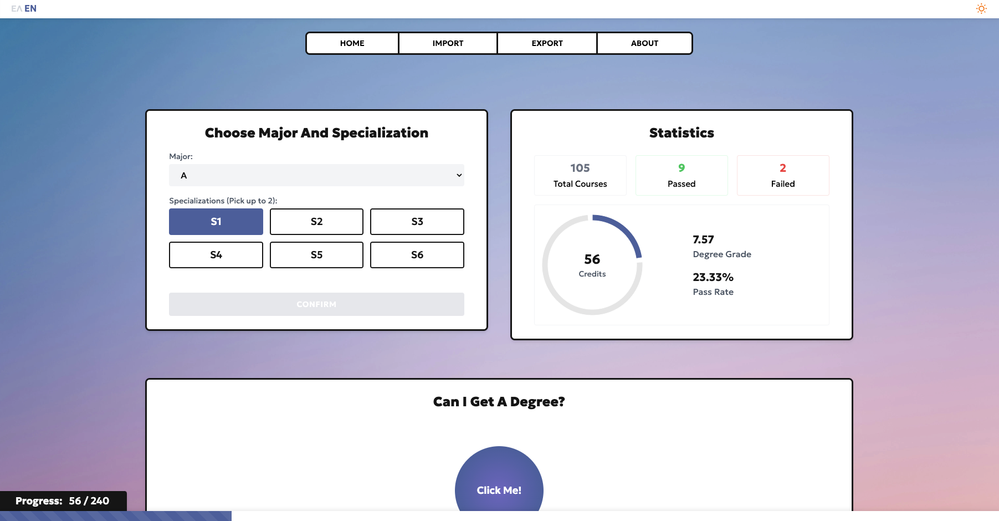
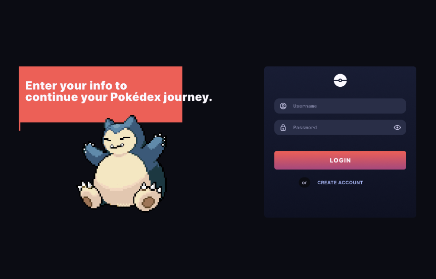

# 👩🏻‍💻 Sophia Banou

**`Junior Front-End Developer / Computer Science Student`**

Hi, I’m Sophia! I’m a front-end developer and a Computer Science student from Athens, Greece. I love creating clean, user-friendly web applications and enjoy learning new technologies. Currently working at **[MainSys](https://mainsys.eu)**.

---

### 🔗 Connect with Me

  &nbsp;
  &nbsp;

---

### 🧰 Tech Stack

  &nbsp;
  &nbsp;
  &nbsp;
  &nbsp;
  &nbsp;
  &nbsp;
  &nbsp;
  &nbsp;
  &nbsp;
  &nbsp;
  &nbsp;
  &nbsp;

---

### 📂 Projects

  
<strong>Grade Calculator</strong>

  
  A degree progress calculator for the Department of Informatics and Telecommunications of the UoA. Allows students to track their academic progress.
  
  **Technologies**: React, Tailwind CSS, JavaScript

[View Project](https://github.com/sophiabanou/grade-calculator)

  
<strong>PokéSpark</strong>

  
  A Pokédex web app that lets you search and view information about various Pokémon.

**Technologies**: Astro

[View Project](https://github.com/sophiabanou/pokedex)

